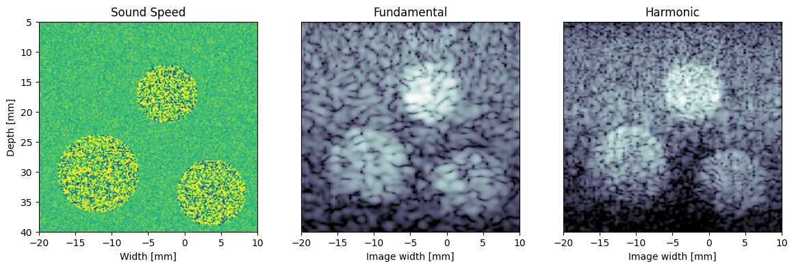

# k-wave-python

[](https://discord.gg/your-invite-code)
[](https://k-wave-python.readthedocs.io/en/latest/?badge=latest)
[](https://codecov.io/gh/waltsims/k-wave-python)

A Python implementation of [k-Wave](http://www.k-wave.org/) — an acoustics toolbox for time-domain simulation of acoustic wave fields. Includes a pure NumPy/CuPy solver (`backend="python"`, supports any CUDA-capable GPU) and an interface to the pre-compiled k-Wave C++ binaries (`backend="cpp"`) with NVIDIA GPU support for compute capability 7.5 (Turing) and newer — covers every consumer/datacenter GPU since 2018, including all shipping Blackwell variants (B200/GB200, B300/GB300, Jetson Thor, RTX 50xx, RTX PRO 6000 Blackwell, GB10/DGX Spark).

## Mission

Increase the accessibility and reproducibility of [k-Wave](http://www.k-wave.org/) simulations for medical imaging, algorithmic prototyping, and testing.

## Getting started



A [collection of examples](../examples/) covers common simulation scenarios. Run any example locally:

```bash
uv run examples/ivp_homogeneous_medium.py
```

No GPU required — all examples run on CPU with NumPy.

## Benchmarks

Reference runtimes for the 3D scaling benchmark in [`benchmarks/benchmark.py`](../benchmarks/README.md). Values are total elapsed seconds for a single default run (3D initial-value problem, heterogeneous absorbing medium, 1000 timesteps, averaged over 3 repeats).

| Backend | OS                    | Accelerator       | 64³ | 128³ | 256³ | Hardware |
|---------|-----------------------|-------------------|-----|------|------|----------|
| python  | Linux                 | CPU               | —   | —    | —    | —        |
| python  | Linux                 | NVIDIA GPU        | —   | —    | —    | —        |
| python  | macOS (Apple Silicon) | CPU               | —   | —    | —    | —        |
| python  | Windows               | CPU               | —   | —    | —    | —        |
| python  | Windows               | NVIDIA GPU        | —   | —    | —    | —        |
| cpp     | Linux                 | CPU (OMP)         | —   | —    | —    | —        |
| cpp     | Linux                 | NVIDIA GPU (CUDA) | —   | —    | —    | —        |
| cpp     | macOS (Apple Silicon) | CPU (OMP)         | —   | —    | —    | —        |
| cpp     | Windows               | CPU (OMP)         | —   | —    | —    | —        |
| cpp     | Windows               | NVIDIA GPU (CUDA) | —   | —    | —    | —        |

Contributions welcome — open a PR filling a row with your k-wave-python version, and (for `cpp` backend) `BINARY_VERSION`. See [`benchmarks/README.md`](../benchmarks/README.md) for the reproducer command.

## Installation

Using [uv](https://docs.astral.sh/uv/) (recommended):

```bash
uv add k-wave-python
```

Or with pip:

```bash
pip install k-wave-python
```

### Older GPUs (Maxwell, Pascal, Volta)

The `backend="cpp"` binaries shipped in v0.6.3+ require compute capability 7.5 (Turing) or newer. CUDA Toolkit 13.0 removed offline-compilation support for older architectures, so the following hardware is not covered by the bundled binaries:

- **Maxwell** (GTX 9xx, Titan X Maxwell, Tesla M-series, Jetson Nano)
- **Pascal** (GTX 10xx, P100, P40, Titan X(p)/Xp, Jetson TX2)
- **Volta** (V100, Titan V, Quadro GV100, Jetson AGX Xavier)

Use `backend="python"` instead (NumPy/CuPy works on every CUDA-capable GPU), or build the C++ backend from source against CUDA Toolkit 12.x.

## Development

Development instructions can be found [here](https://k-wave-python.readthedocs.io/en/latest/development/development_environment.html).

## Related Projects

1. [k-Wave](https://github.com/ucl-bug/k-wave): A MATLAB toolbox for the time-domain simulation of acoustic wave fields.
2. [j-wave](https://github.com/ucl-bug/jwave): Differentiable acoustic simulations in JAX.
3. [ADSeismic.jl](https://github.com/kailaix/ADSeismic.jl): a finite difference acoustic simulator with support for AD
   and JIT compilation in Julia.
4. [stride](https://github.com/trustimaging/stride): a general optimisation framework for medical ultrasound tomography.

## Documentation

The documentation for k-wave-python can be found [here](https://k-wave-python.readthedocs.io/en/latest/).

## Citation
```bibtex
@software{k-Wave-Python,
author = {Yagubbayli, Farid and Sinden, David and Simson, Walter},
license = {GPL-3.0},
title = {{k-Wave-Python}},
url = {https://github.com/waltsims/k-wave-python}
}
```
## Contact

e-mail [walter.a.simson@gmail.com](mailto:walter.a.simson@gmail.com).
