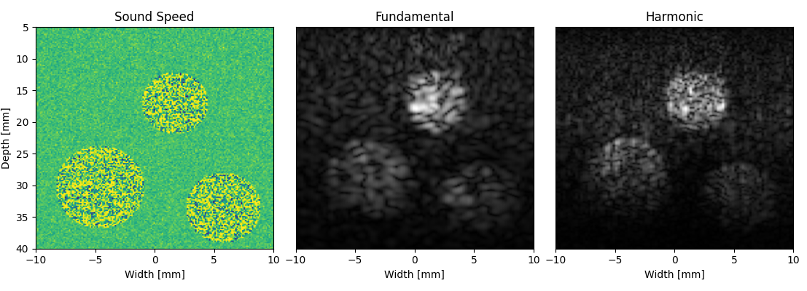

# k-Wave-python

This project is a Python implementation of most of the [MATLAB toolbox k-Wave](http://www.k-wave.org/) as well as an
interface to the pre-compiled v1.3 of k-Wave simulation binaries which support NVIDIA sm 5.0 (Maxwell) to sm 9.0a (Hopper) GPUs.

## Mission

With this project, we hope to increase accessibility and reproducibility of [k-Wave](http://www.k-wave.org/) simulations
for medical imaging, algorithmic prototyping and testing. Many tools and methods of [k-Wave](http://www.k-wave.org/) can
be found here, but this project has and will continue to diverge from the original [k-Wave](http://www.k-wave.org/) APIs
in order to leverage pythonic practices.

## Installation

To install the most recent build of k-Wave-python from PyPI, run:

```bash
pip install k-wave-python
```

After installing the python package, the required binaries will be downloaded and installed the first time you run a
simulation.

## Getting started



After installation, run the B-mode reconstruction example in the `examples` directory of the repository:

```bash
git clone https://github.com/waltsims/k-wave-python
cd k-wave-python
pip install '.[example]' 
python3 examples/bmode_reconstruction_example.py
```

This example file steps through the process of:
 1. Generating a simulation medium
 2. Configuring a transducer
 3. Running the simulation
 4. Reconstructing the simulation

### Requirements
This example expects an NVIDIA GPU by default to simulate with k-Wave.

To test the reconstruction on a machine with a GPU,
set `RUN_SIMULATION` [on line 14 of `bmode_reconstruction_example.py`](https://github.com/waltsims/k-wave-python/blob/master/examples/bmode_reconstruction_example.py#L18)
to `True` and the example will run without the pre-computed data.

## Development

If you're enjoying k-Wave-python and want to contribute, development instructions can be
found [here](https://waltersimson.com/k-wave-python/development/development_environment.html).

## Related Projects

1. [k-Wave](https://github.com/ucl-bug/k-wave): A MATLAB toolbox for the time-domain simulation of acoustic wave fields.
2. [j-wave](https://github.com/ucl-bug/jwave): Differentiable acoustic simulations in JAX.
3. [ADSeismic.jl](https://github.com/kailaix/ADSeismic.jl): a finite difference acoustic simulator with support for AD
   and JIT compilation in Julia.
4. [stride](https://github.com/trustimaging/stride): a general optimisation framework for medical ultrasound tomography.

## Documentation

The documentation for k-wave-python can be found [here](http://waltersimson.com/k-wave-python/)

## Contact

e-mail [walter.simson@tum.de](mailto:walter.simson@tum.de).
